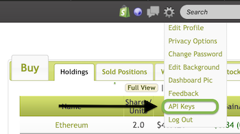

# Wall Street Magnate Crypto API
This is a NodeJS wrapper for virtual/simulated cryptocurrency trading through [Wall Street Magnate's](https://www.wallstreetmagnate.com) platform.

# Installation
```
npm install wsm-api
```

# Quick Start
## Prerequisites
You will need: </br>
    * A Wall Street Magnate account </br>
    * API keys for your account, which can be found here under the gear tab in top right of the WSM UI.
     </br> </br> </br> </br> </br> </br>

## Create Client object
You need to first create a client object that has access to WSM via an access token. The async createClient() function will set this up for you given your API keys. You **must** await this function.

```
let client = await WSM.createClient(MY_API_KEY, MY_API_SECRET)
```

## Making API Calls
All API calls return a promise so you can process the response with any standard promise handling.

```
let client = await WSM.createClient(MY_API_KEY, MY_API_SECRET)

//Search a symbol using await
let searchResponse = await client.searchSymbol("XRP");
console.log(`WSM's data on XRP: " ${searchResponse});

//Purchase 1 BTC on the account you are logged into with then/catch
client.positionBuy("BTC", 1)
  .then((data) => {
    console.log(data);
  })
  .catch((err) => {
    console.log(err);
  })
```

# Demo script
You can try the include demo script, demo demo.js which will run through every function for you. This will attempt to buy 10 Ripple (~$3) for you and sell it immediately after.

```
node demo.js YOUR_API_KEY YOUR_API_SECRET
```

# Functions of the WSM class

### createClient(key, secret)
** Arguments **
* key - the API key
* secret - API secret
** Return **
A fully set up WSM client object that has your access tokens set.

This is a static method of the WSM class and how you will create your client. ** You need to await this function ** as it sets the access token for your client internally. createClient() returns the created client object back to you and all subsequent calls are class functions to this object, so be sure to save the response somewhere. 

### getPositionsOpen()
** Return **
Array of holdings, each as a JSON.

Returns all the open positions (the crypto you are currently holding).

### getPositionsClosed()
** Return **
Array of closed positions, each as a JSON.

Returns all closed positions (sell orders).

### positionBuy(symbol, quantity)
** Arguments **
* Symbol - (string) shortened symbol of the cryptocurrency you intend to buy
* Quantity - (int) The quantity of this coin you intend to buy
** Return **
JSON containing the information from your order. 
** Note **: If you do not have sufficient cash funds in your account to execute this order, you will receive a 400 Error specifying that you do not have the funds to execute this order. 

### positionSell(symbol, quantity, positionId)
** Arguments **
* Symbol - (string) shortened symbol of the coin you intend to sell
* quantity - (int) the quantity of the coin you intend to sell (check note below)
* positionId - (string) id of the open position you are selling from
** Return **
JSON containing the information from your order.
** Note **: This function sells from a position, so the quantity you sell must be <= the quantity in this position. For example, given 2 positions {id:1, "symbol": "ETH", "quantity": 4} and {id:2, "symbol": ETH, "quantity": 400} you must sell from one one of these positions otherwise you will receive a 400 error. </br>
Valid: client.positionSell("ETH", 4, 1), client.positionSell("ETH", 200, 2)
Error: client.positionSell("ETH", 200, 1), client.positionSell("ETH", 404, 2) # Neither position holds enough Etherium

### searchSymbol(symbol)
** Arguments **
* Symbol - (string) shortened symbol of the coin you want to search
** Return **
JSON of search info for the coin matching the symbol.

### getUsersTotals()
** Return **
JSON of account asset totals.

# Reference
Some support currencies and their ticker:
  * Bitcoin - "BTC"
  * Etherium - "ETH"
  * Litecoin - "LTC"
  * Ripple - "XRP"
  * Bitcoin Cash - "BCH"
  * US Dollar - "USD"
  * Bitcoin SV - "BSV"
  * EOS -"EOS"
  * Tezos - "XTZ"
  * Stellar - "XLM"
  * TRON - "TRX"
  * Cosmos - "ATOM"
  * UNUS SED LEO - "LEO"
  * NEO - "NEO"
  * VeChain - "VET"